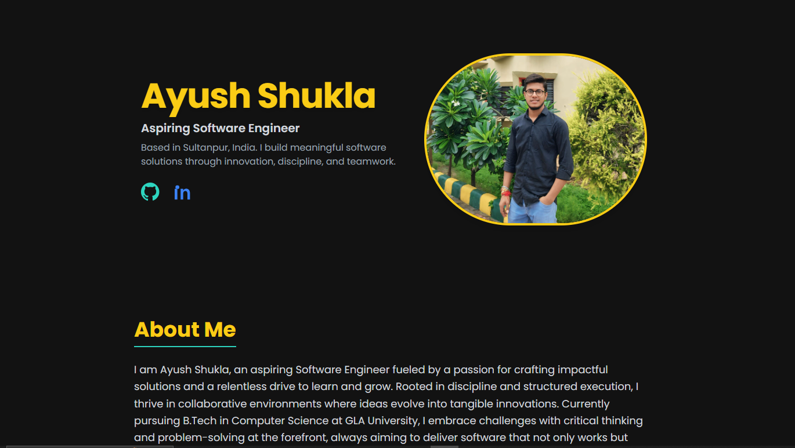

# 💼 Ayush Shukla – Developer Portfolio

Welcome to my personal portfolio website! 🚀  
This project showcases my professional profile, skills, projects, certifications, and achievements as an aspiring software engineer. It is built using **HTML5** and **Tailwind CSS**, following a sleek and responsive dark theme with bold yellow and teal accents.

---

## 🌐 Live Demo

👉 [Click here to view my portfolio](https://v0-ayush-shukla-portfolio.vercel.app/)  
_(Replace the link with your actual deployed URL)_

---

## 🖼️ Preview

You can see a screenshot of the homepage here:

 
_(Make sure you take a screenshot of the site and save it as `screenshot.png` inside the `assets/` folder.)_

---

## 🚀 Features

- Beautiful modern dark UI with high contrast
- Responsive design (mobile-first)
- Hero section with profile, title, and social links
- Animated cards for projects
- Skill tags in grid layout
- Certification & Achievement lists
- Professional “About Me” content
- Clean contact footer with quick links

---

## 🛠️ Tech Stack

- **HTML5** – Semantic, accessible markup  
- **Tailwind CSS** – Utility-first CSS framework  
- **Google Fonts** – ‘Inter’ font for a modern look  
- **Font Awesome** – For social and UI icons  
- **Responsive Design** – Works across all devices  

---

## ⚙️ How to Use in VS Code

1. **Clone or download** the project:
   ```bash
   git clone https://github.com/Ayushcs23/portfolio.git
