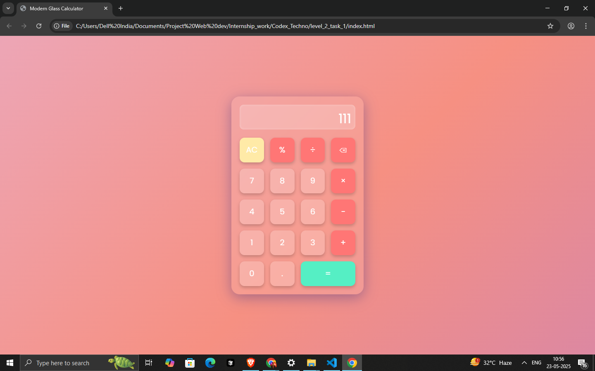

# 🌟 Modern Calculator Web App

This is a modern, responsive, and visually stunning calculator web application built using **HTML**, **CSS**, and **JavaScript**. The design features a clean user interface, smooth animations, glassmorphism effects, and a vibrant gradient background. It works beautifully on both desktop and mobile devices.

## 🔧 Features

- ✨ **Glassmorphism Design** with smooth shadows and vibrant colors
- ⚡ **Real-time Display Updates**
- 📱 **Fully Responsive** and mobile-friendly
- 🎨 **Hover Animations** for interactive buttons
- 💡 **Dark Theme** for a modern aesthetic
- 🔢 Basic operations: Addition, Subtraction, Multiplication, Division, Modulus
- 🧠 Built with **CSS Grid** for clean layout structure

## 📂 File Structure

project-folder/
│
├── index.html # HTML structure of the calculator
├── style.css # Stylish and responsive design
└── script.js # JavaScript logic for calculator operations

## 🚀 Getting Started

1. **Clone or Download** the repository.
2. Open `index.html` in your favorite web browser.
3. Start using the calculator!

## 📸 Screenshots

  
*A smooth, glassy and vibrant calculator UI.*

## 💡 Future Improvements (Optional)
- Theme toggler (light/dark)
- Keyboard support
- Scientific calculator mode

## 🧑‍💻 Developed By

Ayush Shukla (as part of CodeX Techno Internship - Level 2, Task 1)
