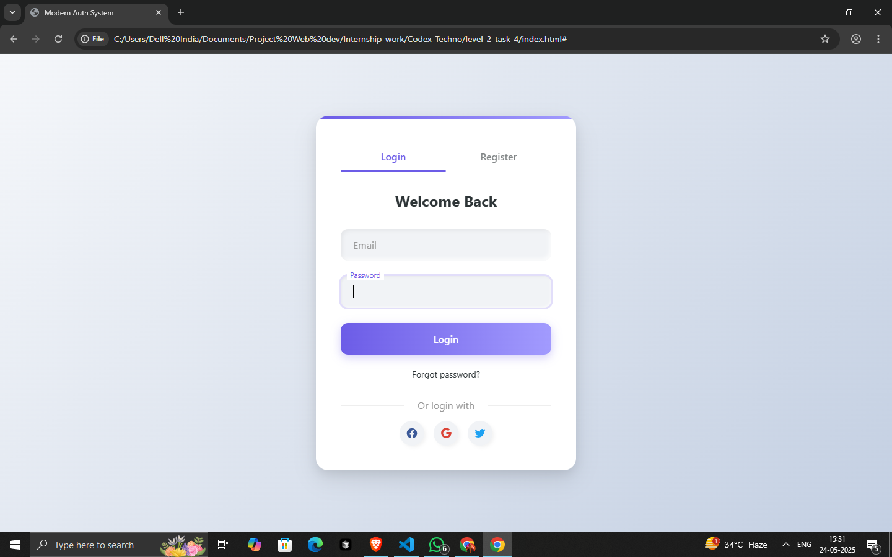

# Modern Authentication System

A sleek, responsive login and registration system with smooth animations and neumorphic design elements.

 *(Note: You should add an actual screenshot file)*

## Features

- **Dual Form System**: Toggle between login and registration forms
- **Modern UI Design**: 
  - Neumorphic elements with soft shadows
  - Gradient accents
  - Floating label animations
- **Responsive Layout**: Works on all device sizes
- **Form Validation**:
  - Real-time error checking
  - Animated error messages
  - Required field validation
- **Interactive Elements**:
  - Smooth tab transitions
  - Button hover effects
  - Social login icons
- **Security**: 
  - Password confirmation
  - Email format validation

## Technologies Used

- HTML5
- CSS3 (with CSS Variables)
- JavaScript (Vanilla ES6)

## Installation

No installation required! Simply:

1. Download the project files
2. Open `index.html` in any modern browser

## File Structure
modern-auth-system/
├── index.html # Main HTML file


## Customization

### Colors
Edit the CSS variables in `:root` to change the color scheme:
```css
:root {
    --primary: #6c5ce7;       /* Main purple color */
    --secondary: #a29bfe;     /* Lighter purple */
    --dark: #2d3436;         /* Dark text color */
    --light: #f5f6fa;        /* Light background */
    --success: #00b894;      /* Success message color */
    --error: #d63031;        /* Error message color */
}
Animations
Adjust animation timing in the CSS:

css
.auth-form {
    animation: fadeIn 0.5s ease forwards;
}
Browser Support
The system works on all modern browsers including:

Chrome (latest)

Firefox (latest)

Safari (latest)

Edge (latest)

Known Issues
Password strength is not currently checked beyond length

Social login buttons are for display only (no actual functionality)

Future Improvements
Add password strength meter

Implement actual social login functionality

Add "Remember me" checkbox

Implement CAPTCHA for security

Add dark mode support

Contributing
Contributions are welcome! Please fork the repository and submit a pull request.

License
This project is open source and available under the MIT License.

Created by [Ayush Shukla] - Feel free to customize this for your needs!


## Additional Recommended Files

You might also want to create these files:

1. `LICENSE` - For your chosen open source license
2. `screenshot.png` - An actual screenshot of your project
3. `.gitignore` - If you plan to use Git
